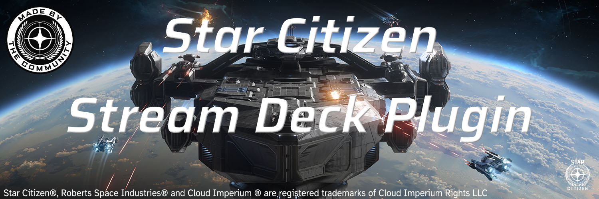

Welcome to the Star Citizen Stream Deck Plugin!
This plugin lets you control various aspects of Star Citizen from your Elgato Stream Deck.

[Download Latest](https://github.com/Jarex985/SCStreamDeck/releases/latest/download/com.jarex985.scstreamdeck.streamDeckPlugin){ .md-button }
[Install Guide](install.md){ .md-button }
[Troubleshooting](troubleshooting.md){ .md-button }

## Quick Start

1. Please make sure you have **all** [requirements](install.md#requirements) installed.
2. Click the `Download Latest` button above.
3. Double-click the downloaded `.streamDeckPlugin` file.
4. Open Stream Deck and drag the desired key from the right panel onto a key slot on the left.

!!! tip "The plugin needs a moment to initialize."
    - Wait until the loading spinner on the keys disappears.  
    - If it can’t detect your Star Citizen installation, it will show an error message.  
    - In this case, open the `Control Panel` key and set a custom installation path for your desired channel (`LIVE`, `HOTFIX`, `PTU`, `EPTU`).

## Features

- **Adaptive Key**: A key that executes keybindings based on the activation mode for a given binding.
    - *Example:* Two in-game bindings (Tap vs Hold) on `Num-` executes only the Tap function when this is the assigned function.
- **Toggle Key**: A key that toggles between two states (e.g., landing gear up/down). Can be reset to match the current in-game state on de-sync.
- **Control Panel Key**: A dedicated key for managing global plugin settings such as themes, channel selection, and installation paths.
- **Auto-Detection of Star Citizen Installation Path**: Automatically detects the installation path of Star Citizen.
- **Multiple Channels Support**: Supports different Star Citizen channels including LIVE, HOTFIX, PTU, and EPTU.
- **Mouse Wheel Support**: Supports mouse wheel actions for bindings that use mouse wheel input (Mouse Wheel Up/Down).
- **Custom Language Support**: Supports custom language files for localization when using custom global.ini from the community, e.g. [StarCitizen-Deutsch-INI by rjcncpt](https://github.com/rjcncpt/StarCitizen-Deutsch-INI).
- **Theme Support**: Themes for customizing the appearance of the plugin. Includes a template for creating your own themes!
- **Click Sound**: Provides audio feedback on key presses with configurable sound files (.wav and .mp3).

