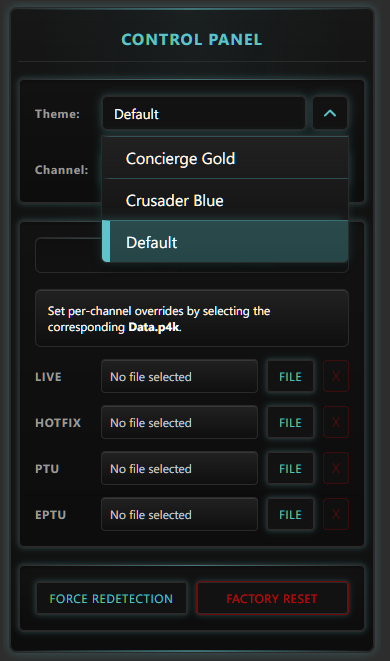

# Themes

The Plugin supports themes for the Property Inspector UI.

## Pick a Theme

1. Add `Control Panel` to any key.
2. Open the Property Inspector.
3. Choose a theme from the Theme dropdown.

{ style="width:45%; height:auto;" }

## Create a Custom Theme

You can create your own theme by copying the `_theme-template.css` and changing a few color values.

Template file location:

`%APPDATA%\Elgato\StreamDeck\Plugins\com.jarex985.scstreamdeck.sdPlugin\PropertyInspector\css\themes\`

You will find RGB color values defined as:

```css
:root {
    /* Copy this file and change the RGB triplets below.
       Name the new file according to your theme, e.g., "my-theme.css".
       Plugin will automatically convert the name to "My Theme" in the UI.
       All component styles consume derived --color-* tokens from base.css. */

    /* Accent */
    --theme-accent-rgb: 212, 175, 55;
    --theme-accent-hi-rgb: 255, 215, 0;

    /* Surfaces */
    --theme-surface-0-rgb: 18, 18, 18;
    --theme-surface-1-rgb: 15, 15, 15;
    --theme-surface-2-rgb: 33, 33, 33;

    /* Borders */
    --theme-border-rgb: 42, 42, 42;

    /* Optional: theme-specific text colors (overrides base.css defaults) */
    --color-text-primary: rgba(245, 252, 255, 1);
    --color-text-secondary: rgba(var(--theme-accent-hi-rgb), 0.95);
    --color-text-tertiary: rgba(150, 185, 200, 0.75);
}
```

### Steps

1. Copy content of `_theme-template.css` to a new file, for example `my-theme.css`.
2. Change the RGB values in the new file.
    - You can use e.g. [https://rgbcolorpicker.com/](https://rgbcolorpicker.com/) if you need help picking colors.
3. Save the new file in the `themes` folder.
4. Restart Stream Deck.
5. Open `Control Panel` and select the new theme.

!!! note "Theme Name"
    The dropdown name is generated from the filename. Example: `my-theme.css` shows up as `My Theme`.
