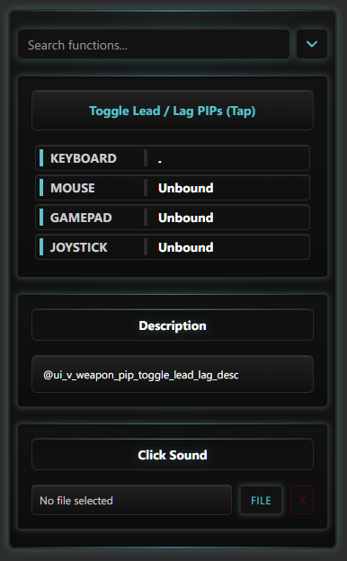
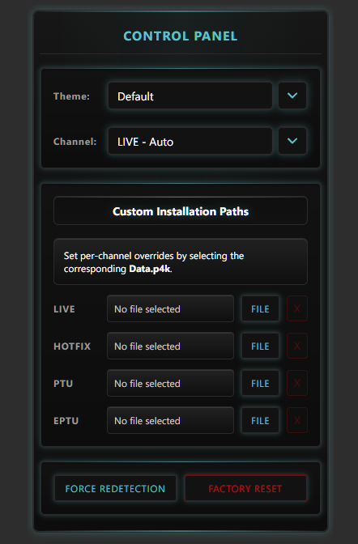

# Usage

## Adaptive Key

Use `Adaptive Key` for bindings you want to trigger in Star Citizen.

Basic flow:

1. Drag `Adaptive Key` onto a Stream Deck button.
2. Click on it to open the Property Inspector.
3. Select the Star Citizen function you want.
4. (Optional) Select a Sound file (.wav/.mp3) from your system.

{ style="width:45%; height:auto;" }

## Control Panel Key

Use `Control Panel` for global plugin settings:

- Theme
- Channel (`LIVE`, `HOTFIX`, `PTU`, `EPTU`)
- Custom paths (if auto-detection fails)
- Force Redetection
- Factory reset

{ style="width:45%; height:auto;" }

!!! note "What Force Redetection & Factory Reset does"
    - **Force Redetection**: It re-runs the auto-detection of your Star Citizen installation path and keybindings. Use this if you moved your installation or changed keybindings in-game.
    - **Factory Reset**: It clears cached installs, current theme, custom overrides, rebuilds keybindings. Use this if you experience issues with the plugin.
